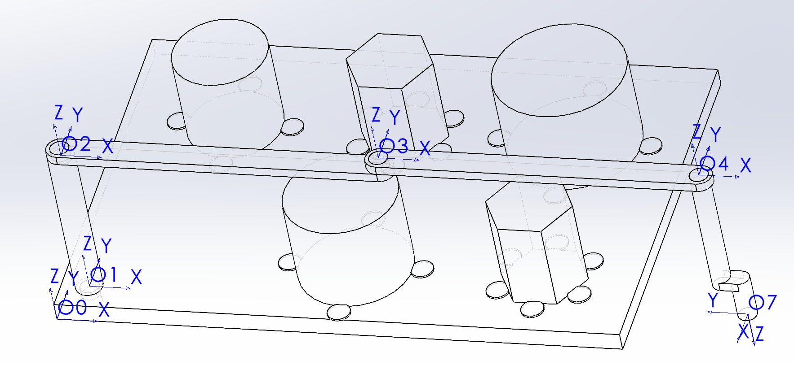
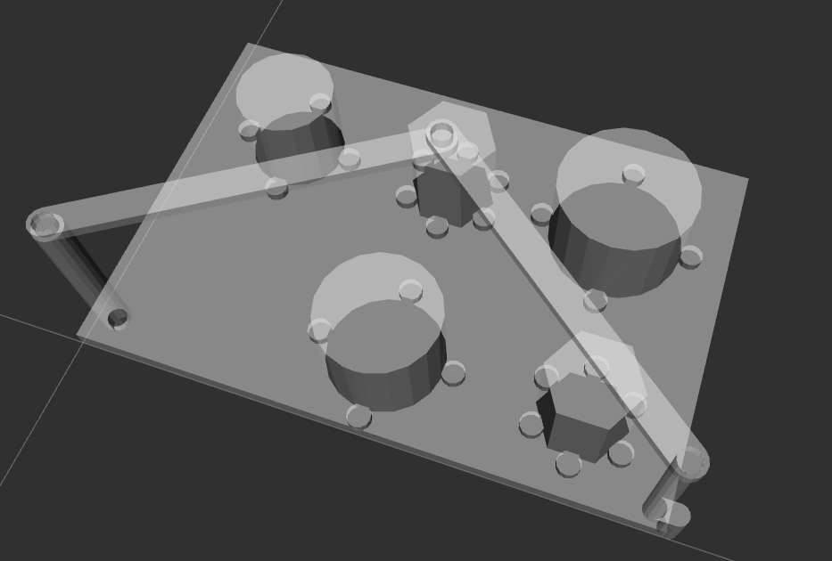
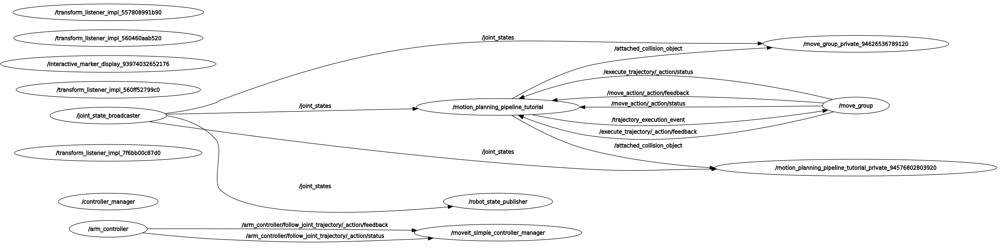
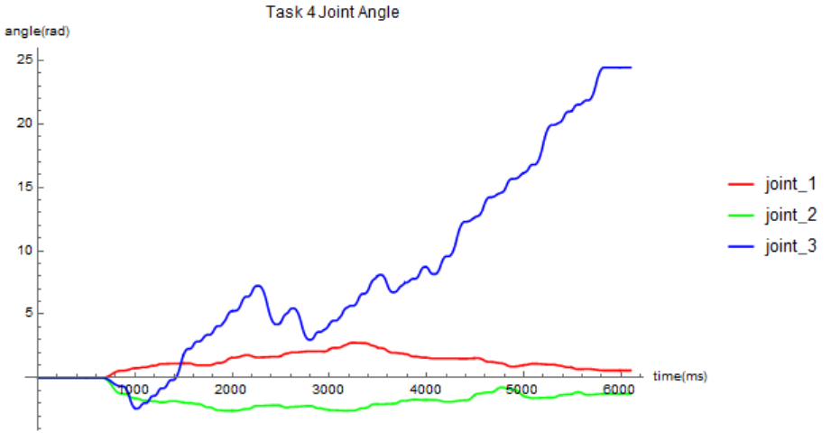
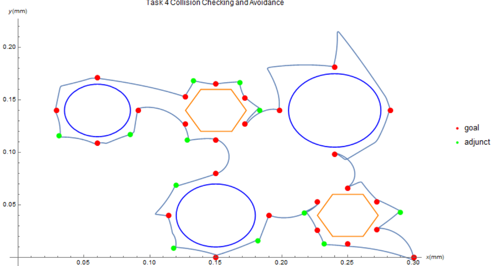
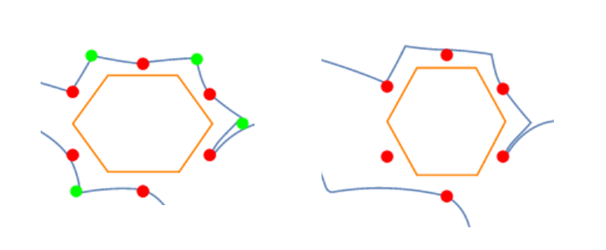
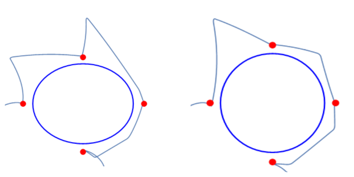

# Task 4

## Role

Task 4 consumes the authoritative Task 3 trajectory artifacts (in both joint space and Cartesian space) and checks for potential collisions between the welding torch, the objects, and the robotic arm.

The implementation performs collision detection with a clearance of 1 mm. If a collision is detected, it iteratively modifies the Task 2 path and the Task 3 trajectory until a collision-free solution is achieved, while preserving the Task 1 weld order.

The implementation uses ROS 2 MoveIt 2 for collision checking and trajectory adaptation. The robot, welding torch, and environmental objects are modeled as collision objects in the MoveIt planning scene. Collision detection is performed with a clearance of 1 mm using MoveIt’s built-in collision checker. If a collision is detected, the affected waypoints in the Task 2 path are adjusted (e.g., by inserting or shifting intermediate points) and the Task 3 trajectory is re-planned in both joint space and Cartesian space. This process is iterated until the full trajectory is verified as collision‑free, while the Task 1 weld order is preserved.

## Runtime Environment

    System : Ubuntu 22.04 @ WSL2
    Environment : ROS2 humble (deb packages from Tsinghua Open Source Mirror)
    Framework : Moveit2 (deb packages from Tsinghua Open Source Mirror)
    Visualization : RViz2

## Work Flow

### Step 1. Solidworks Modeling

The provided CAD files on Canvas contained some undefined part sketches, which led to coordinate errors in the obstacle models. We redrew the affected parts and generated a corrected assembly file.

### Step 2. Assembly to URDF

We defined joint coordinate frames and rotation axes for each joint in the assembly. Using the SW2URDF plugin, we configured joint motion limits, link connections, and collision geometries, then exported the URDF file. We validated the exported URDF file using an online visualization tool (https://viewer.robotsfan.com/) to ensure it was configured correctly.

<div align="center">

<center>Coordinate Configuration</center>
<br><br>
</div>

### Step 3. Moveit2 Setup Assistant

Install ROS2 and Moveit2:

```bash
sudo mkdir -p /etc/apt/keyrings curl -sSL https://raw.githubusercontent.com/ros/rosdistro/master/ros.key | sudo tee /etc/apt/keyrings/ros-archive-keyring.gpg > /dev/null

echo "deb [signed-by=/etc/apt/keyrings/ros-archive-keyring.gpg] https://mirrors.tuna.tsinghua.edu.cn/ros2/ubuntu/ jammy main" | sudo tee /etc/apt/sources.list.d/ros2-latest.list > /dev/null

sudo apt install python3-rosdep
sudo apt install python3-colcon-common-extensions
sudo apt install python3-colcon-mixin

sudo apt update sudo apt install ros-humble-desktop

echo "source /opt/ros/humble/setup.bash" >> ~/.bashrc
```

Create workspace and run Moveit2 Setup Assistant:

```bash
mkdir -p ~/ws_moveit/src

ros2 launch moveit_setup_assistant setup_assistant.launch.py
```

Next, we fixed naming inconsistencies and corrected mesh file paths in the 
URDF file. We then created a package with the intended name and inserted the URDF and mesh files into workspace. Following the official MoveIt documentation (https://moveit.picknik.ai/main/doc/examples/setup_assistant/setup_assistant_tutorial.html), we imported the URDF file into the assistant, configured the planning groups and controllers, and exported the final configuration package, overwriting the previously created package.

```bash
ros2 pkg create \
 --build-type ament_cmake \
 --dependencies moveit_ros_planning_interface rclcpp \
 --node-name smmg smmg
```

### Step 4. Check Moveit2 Configuration

Start the MoveIt demo to interactively plan and execute motions for the robot in RViz.

```bash
colcon build

source install/setup.bash

ros2 launch smmg demo.launch.py
```

<div align="center">

<center>RViz</center>
<br><br>
</div>

### Step 5. Trajectory Publish and Simulation

Following the official documentation (https://moveit.picknik.ai/main/doc/examples/motion_planning_api/motion_planning_api_tutorial.html), the trajectory publishing code was implemented.
The robotic arm was controlled to execute the trajectory commands, and the resulting
motion was visualized and verified in RViz.

```bash
colcon build

ros2 launch hello_moveit demo.launch.py
```

<div align="center">

<center>ROS Node and Topic</center>
<br><br>
</div>

### Step 6. Recording and Analysis

Install PlotJuggler:

```bash

sudo apt install ros-humble-plotjuggler
sudo apt install ros-humble-plotjuggler-ros

```
  
Start PlotJuggler before simulation, listen the topic: /joint_states and export as CSV file.

```bash
ros2 run plotjuggler plotjuggler
```

Use Mathematica or Matlab to calculate the trajectory of the end position and analysis result.

<div align="center">

<center>Joint Angle</center>
<br><br>
</div>

<div align="center">

<center>Joint Angle</center>
<br><br>
</div>

## Simulation Configuration

Joint configuration:

    default_robot_padding: 0.001

    Joint1:
        type: revolute
        lower: 0.0
        upper: 3.14
        has_velocity_limits: true
        max_velocity: 1.5
        has_acceleration_limits: true
        max_acceleration: 1.5

    Joint2:
        type: continuous
        has_velocity_limits: true
        max_velocity: 1.5
        has_acceleration_limits: true
        max_acceleration: 1.5

    Joint3:
        type: continuous
        has_velocity_limits: true
        max_velocity: 5.0
        has_acceleration_limits: true
        max_acceleration: 5.0

The lower joint limit of joint1 was set to 0.0 rad to restrict the workspace to the target scene and avoid redundant inverse kinematic solutions. Joint3 was assigned higher velocity and acceleration limits to improve simulation performance. A collision padding radius of 1 mm was applied to all links.

Pilz planner configuration:

    cartesian_limits:
        max_trans_vel: 1.0
        max_trans_acc: 0.25
        max_trans_dec: -5.0
        max_rot_vel: 0.157

Limit the move velocity and acceleration in cartesian space.

Kinematics configuration:

    arm:
        kinematics_solver: kdl_kinematics_plugin/KDLKinematicsPlugin
        kinematics_solver_search_resolution: 0.0020000000000000001
        kinematics_solver_timeout: 0.0050000000000000001

The arm group uses the KDL kinematics plugin with a search resolution of 0.002 (rad/m) and a timeout of 0.005 s. This provides sufficient IK accuracy for the task while keeping solve times low.

## Simulation Result

The simulation result is presented in Step 6 of the work flow. Overall, the requirements of Task 4 have been met: the robotic arm traversed all target points specified by the Task 1 weld order without any collision. However, certain details still offer room for further optimization.

In certain scenarios, omitting an adjunct point can cause collisions and motion planning failures, which may result in the target point being missed:

<div align="center">

<center>Target Point Loss</center>
<br><br>
</div>

In some scenarios, the robotic arm may suddenly move away from obstacles and then return to the next point. Adding an adjunct point can improve this situation.

<div align="center">

<center>Divergent planning results</center>
<br><br>
</div>

